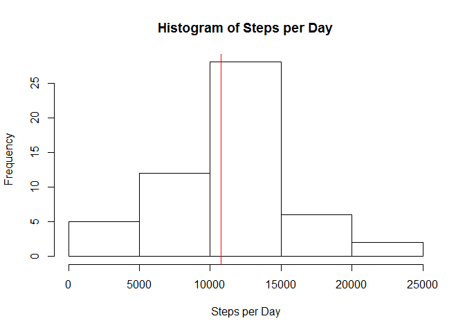
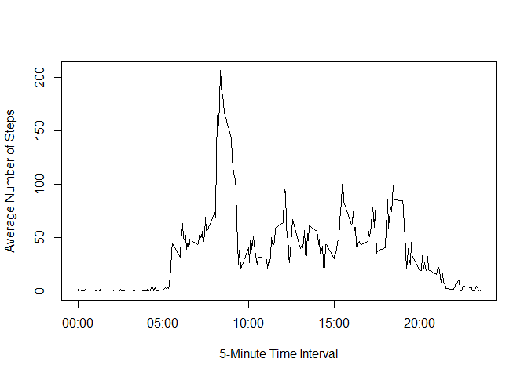
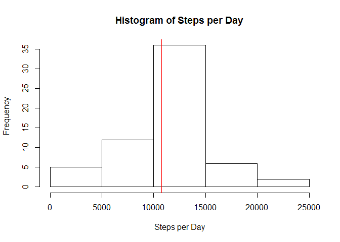
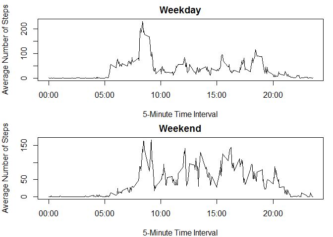

# Reproducible Research: Peer Assessment 1
chris-sms  
October 26, 2016  

## Loading and preprocessing the data

First, perform some initial r setup to set global preferences and load required libraries.


```r
knitr::opts_chunk$set(echo = TRUE)
library(dplyr)  # used for data manipulation
library(stringr) # used for text manipulation
options (scipen=10) # turn off scientific notation for small numbers in inline display.
```

Next, load the data file (using cache to avoid reloading) and preprocess the data to set the date format.  I also created a new variable "formatted interval" to make it clearer what the time intervals refer to (each time interval refers to a time on the 24 hour clock - e.g., interval 1030 means 10:30).


```r
# Load the data from the source file
zipfile<-"https://d396qusza40orc.cloudfront.net/repdata%2Fdata%2Factivity.zip"
filename<-"activity.csv"
temp <- tempfile()
download.file(zipfile,temp)
mydata <- read.table(unz(temp, filename),sep=',',header=TRUE,na.strings="NA")
unlink(temp)
# Pre-processing
# Set date format
mydata$date<-as.Date(mydata$date)
# Add a formatted interval for cleaner display
tempinterval<-str_pad(mydata$interval,4,side="left",pad="0")
mydata$formattedinterval<-paste(str_sub(tempinterval,1,2),str_sub(tempinterval,start=-2),sep=":")
```

## What is mean total number of steps taken per day?

This code creates a subset of data with records containing NA values omitted.  It then calculates the total number of steps taken each day, and creates a histogram.  The mean and median number of steps are computed and the mean number of steps is displayed on the historgram as a red line.


```r
# Remove NA values for this section of analysis
mydataNoNA<-na.omit(mydata)
# Calculate the total number of steps taken per day
totalsteps <- mydataNoNA %>% group_by(date) %>% summarise(steps = sum(steps))
# Calculate and report the mean and median of the total number of steps taken per day
mean(totalsteps$steps)
```

```
## [1] 10766.19
```

```r
median(totalsteps$steps)
```

```
## [1] 10765
```

```r
# Plot a histogram of the total number of steps taken each day
hist(totalsteps$steps,main="Histogram of Steps per Day",xlab="Steps per Day")
abline(v=mean(totalsteps$steps),col="red")
```

<!-- -->

The mean number of steps per day was 10766.2 and the median number of steps per day was 10765.

## What is the average daily activity pattern?

This code chunk calculates and plots the average number of steps taken during each time interval, averaged across all days.  It also identifies the interview which contains the highest average number of steps.


```r
# Calculate the average number of steps taken during each interval
stepsbyinterval <- mydataNoNA %>% group_by(interval,formattedinterval) %>% summarise(steps = mean(steps))
# Plot the histogram
plot(x=stepsbyinterval$interval,y=stepsbyinterval$steps,type="l",xlab="5-Minute Time Interval",ylab="Average Number of Steps",xaxt="n")
axis(1,at=axTicks(1),labels=paste(str_sub(str_pad(axTicks(1),4,side="left",pad="0"),1,2),str_sub(str_pad(axTicks(1),4,side="left",pad="0"),start=-2),sep=":"))
```

<!-- -->

```r
# Identify the time interval which had the maximum number of steps.
HighInt<-stepsbyinterval[which(stepsbyinterval$steps==max(stepsbyinterval$steps)),]
HighInt$formattedinterval
```

```
## [1] "08:35"
```

The interval with the highest average number of steps was 08:35 with 206.2 steps.

## Imputing missing values

This section computes the total number of NA records in the data file.  There are over 2000 NA records.  To avoid introducing bias into the calculations, I devised a strategy to replace the missing values for the number of steps with the mean number of steps taken during the same interval.  This section updates the mean and median estimates, and redraws the histogram, based on the imputed data.


```r
# Count NAs
sum(!complete.cases(mydata))
```

```
## [1] 2304
```

```r
# nrow(mydata)-nrow(mydataNoNA) # unused - equivalent approach
# Replace NAs with imputed value = mean number of steps in the time interval, rounded to nearest integer
mydataimputed<-merge(mydata,stepsbyinterval[,c(1,3)],by="interval")
colnames(mydataimputed)[2]<-"steps"
colnames(mydataimputed)[5]<-"mean_steps"
mydataimputed[is.na(mydataimputed$steps),]$steps<-mydataimputed[is.na(mydataimputed$steps),]$mean_steps
mydataimputed<-mydataimputed[,1:4]
# Calculate the total number of steps taken per day
totalsteps2 <- mydataimputed %>% group_by(date) %>% summarise(steps = sum(steps))
# Calculate and report the mean and median of the total number of steps taken per day
mean(totalsteps2$steps)
```

```
## [1] 10766.19
```

```r
median(totalsteps2$steps)
```

```
## [1] 10766.19
```

```r
# Plot the histogram
hist(totalsteps2$steps,main="Histogram of Steps per Day",xlab="Steps per Day")
abline(v=mean(totalsteps2$steps),col="red")
```

<!-- -->

The overall impact of imputing missing values on the estimate of the total daily number of steps was minimal.  After imputing missing data, the mean number of steps per day was 10766.2 and the median number of steps per day was 10766.2.  These results are nearly identical to the original results in this example.  This is due to the distribution of NAs in the source data and the method by which the mean and median were computed.

The NAs in the original data set were concentrated only in 8 specific days - 10/1, 10/8, 11/1, 11/4, 11/9, 11/10, 11/14, and 11/30/2012.  Further, for each day in which an NA occurred, the number of steps was set to NA for all intervals through the day (there are 288 intervals in each day).  Because each day with non-NA data was a complete day, there were no incomplete days in the data set, and therefor the total steps per day was not corrupted.


```r
mydataNAOnly<-mydata[is.na(mydata),]
table(mydataNAOnly$date)
```

```
## 
## 2012-10-01 2012-10-08 2012-11-01 2012-11-04 2012-11-09 2012-11-10 
##        288        288        288        288        288        288 
## 2012-11-14 2012-11-30 
##        288        288
```

Because the missing days were set to the averages of the non-missing days, the overall average daily steps did not change.  Using the "No NA" dataset, the mean total daily steps was 10766.2, and using the imputed dataset, it was also 10766.2.  The histogram did change slightly with 8 additional days in the center bar (reflecting 8 additional "average" imputed days), and the median also changed slightly from 10765 to 10766.2.

## Are there differences in activity patterns between weekdays and weekends?

First, I create a new factor variable in the dataset to indicate whether each day was a weekend or weekday.


```r
# weekday/weekend analysis
mydataimputed$weekpart<-"weekday"
mydataimputed[weekdays(mydataimputed$date) %in% c("Saturday","Sunday"),]$weekpart<-"weekend"
mydataimputed$weekpart<-as.factor(mydataimputed$weekpart)
```

Next, I process the data to summarize the average number of steps in each interval separately for weekends and weekdays.


```r
# create summary of steps by interval for each weekpart
stepsbyinterval2 <- mydataimputed %>% group_by(interval,formattedinterval,weekpart) %>% summarise(steps = mean(steps))
```

Finally, I generate the panel plot to show the different patterns on weekends and weekdays.  I used the base plotting system to generate the panel plot.


```r
# Generate plot
par(mfrow = c(2, 1), mar = c(4, 4, 2, 1))

# This is the weekday portion of the plot.
plot(x=stepsbyinterval2[stepsbyinterval2$weekpart=="weekday",]$interval,y=stepsbyinterval2[stepsbyinterval2$weekpart=="weekday",]$steps,type="l",main="Weekday",xlab="5-Minute Time Interval",ylab="Average Number of Steps",xaxt="n")
axis(1,at=axTicks(1),labels=paste(str_sub(str_pad(axTicks(1),4,side="left",pad="0"),1,2),str_sub(str_pad(axTicks(1),4,side="left",pad="0"),start=-2),sep=":"))

# This is the weekend portion of the plot.
plot(x=stepsbyinterval2[stepsbyinterval2$weekpart=="weekend",]$interval,y=stepsbyinterval2[stepsbyinterval2$weekpart=="weekend",]$steps,type="l",main="Weekend",xlab="5-Minute Time Interval",ylab="Average Number of Steps",xaxt="n")
axis(1,at=axTicks(1),labels=paste(str_sub(str_pad(axTicks(1),4,side="left",pad="0"),1,2),str_sub(str_pad(axTicks(1),4,side="left",pad="0"),start=-2),sep=":"))
```

<!-- -->

